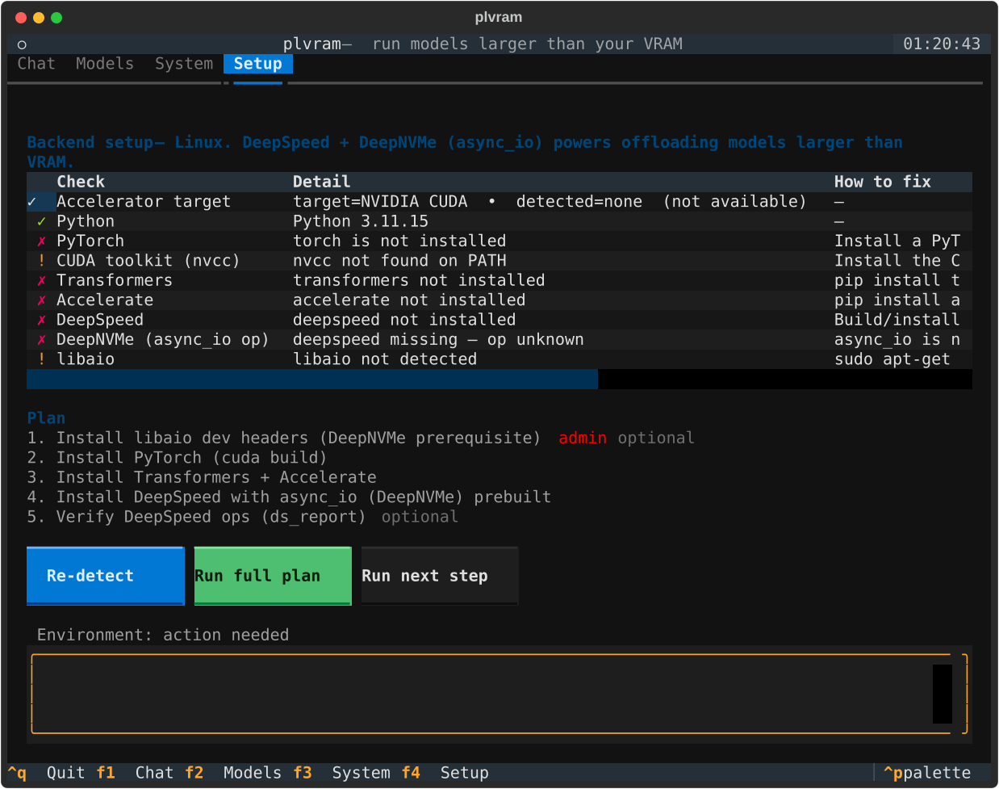

# Potentially-low-vram (`plvram`)

> Great, low VRAM and I can't run my favourite models. **Or can I?**

`plvram` is a cross-platform **terminal UI for running local AI models that are
larger than your VRAM**. It drives **DeepSpeed ZeRO-Inference** with
**DeepNVMe** offloading so model weights that don't fit on the GPU are streamed
from CPU RAM and NVMe storage on demand — letting a modest GPU run models many
times the size of its memory.

It also tackles the *other* hard problem: **getting DeepSpeed (and the
`async_io` op DeepNVMe needs) built on Windows**. The Setup tab detects your
toolchain and runs a guided build so you don't have to fight `vcvars`, CUDA
paths and build flags by hand.



## Highlights

- **Run models bigger than VRAM** — ZeRO-3 with `cpu` or `nvme` parameter
  offload. NVMe offload uses DeepNVMe (`async_io`) to stream weights from a
  fast SSD.
- **TUI for everything** — chat with the model, pick models & offload tiers,
  inspect your hardware, and run setup, all from the terminal.
- **Windows-friendly setup** — detects MSVC / CUDA / Ninja and builds DeepSpeed
  from source with `DS_BUILD_AIO=1` via `scripts/setup_windows.ps1`.
- **Linux setup** — installs `libaio` + a DeepNVMe-enabled DeepSpeed.
- **Degrades gracefully** — the TUI runs (in *demo mode*) even before the
  backend is installed, so you can configure and drive setup first.

## Install

```bash
# Core TUI (works immediately, demo mode until the backend is built)
pip install -e .

# Inference backend (large; or use the in-app Setup tab)
pip install -e ".[backend]"
```

Python 3.9+ is required. A CUDA-capable NVIDIA GPU is needed for real
inference.

## Quick start

```bash
plvram            # launch the TUI
plvram doctor     # print the environment report and exit
plvram plan       # show the setup plan for this machine
plvram setup      # run the platform setup script (builds DeepSpeed + DeepNVMe)
```

In the TUI:

| Key | Tab | What it does |
|-----|-----|--------------|
| F1  | **Chat**   | Send prompts, stream replies. |
| F2  | **Models** | Choose model id, dtype, and offload tier. |
| F3  | **System** | GPUs/VRAM, RAM, offload disk + a recommended offload tier. |
| F4  | **Setup**  | Detect the backend environment and run a guided build. |

Typical first run: open **Setup** → review the checks → **Run full plan** to
build DeepSpeed (with DeepNVMe). Then set your model and offload tier on
**Models**, **Load model**, and chat.

## How offloading works

`plvram` builds a DeepSpeed ZeRO-3 inference config from your choices
(`plvram/engine/ds_config.py`):

- **`none`** — keep all weights on the GPU (only if they fit).
- **`cpu`** — offload parameters to pinned CPU RAM (`offload_param.device =
  cpu`). Runs models larger than VRAM but bounded by system RAM.
- **`nvme`** — offload parameters to NVMe (`offload_param.device = nvme`) with
  a DeepNVMe `aio` block (`block_size`, `queue_depth`, `thread_count`, …).
  Runs models larger than RAM by streaming weights off a fast local SSD.

The **System** tab estimates your model's size and recommends a tier based on
available VRAM, RAM, and offload-disk space.

## Windows setup (the hard part, automated)

DeepSpeed on Windows needs the MSVC C++ toolchain, a matching CUDA toolkit, and
a source build with the right flags. The Setup tab (and `plvram setup`) run
[`scripts/setup_windows.ps1`](scripts/setup_windows.ps1), which:

1. Locates Visual Studio via `vswhere` and imports the MSVC dev environment
   (`vcvars64.bat`) so `cl.exe` is on PATH.
2. Verifies the CUDA toolkit (`nvcc`).
3. Sets `DISTUTILS_USE_SDK=1` and (with `-BuildAio`) `DS_BUILD_AIO=1` so the
   `async_io` op for DeepNVMe is compiled in.
4. Builds DeepSpeed from source and installs it.
5. Runs `ds_report` to confirm `async_io` shows `[OKAY]`.

Prerequisites it can't install silently (Visual Studio Build Tools with the
"Desktop development with C++" workload, and the CUDA Toolkit) are surfaced as
clearly-labelled steps with instructions.

## Linux setup

[`scripts/setup_linux.sh`](scripts/setup_linux.sh) installs `libaio` dev headers
for your package manager, then installs Transformers/Accelerate and a DeepSpeed
built with `DS_BUILD_AIO=1`. Install a CUDA build of PyTorch matching your
driver from <https://pytorch.org/get-started/locally/>.

## Development

```bash
pip install -e ".[dev]"
pytest                 # 17 tests, no GPU required (TUI runs headless)
textual run --dev plvram.tui.app:PLVRamApp   # hot-reload the UI
```

The heavy ML stack is imported lazily, so the package imports and the test
suite run on a CPU-only box with no backend installed.

## Project layout

```
plvram/
  cli.py              entry point: run / doctor / plan / setup
  config.py           persisted config (model, dtype, offload tiers)
  engine/
    vram.py           GPU/RAM/disk probing (torch -> nvidia-smi -> none)
    ds_config.py      DeepSpeed ZeRO-3 + DeepNVMe config builder
    inference.py      ZeRO-Inference engine (+ demo mode fallback)
  setup/
    environment.py    per-platform capability detection
    planner.py        report -> ordered setup steps
    linux.py          Linux plan (libaio + DeepSpeed)
    windows.py        Windows plan (MSVC/CUDA detect + guided build)
    runner.py         streaming step executor
  tui/                Textual app + Chat/Models/System/Setup tabs
scripts/
  setup_windows.ps1   guided DeepSpeed + DeepNVMe build for Windows
  setup_linux.sh      libaio + DeepSpeed install for Linux
```

## License

MIT — see [LICENSE](LICENSE).
